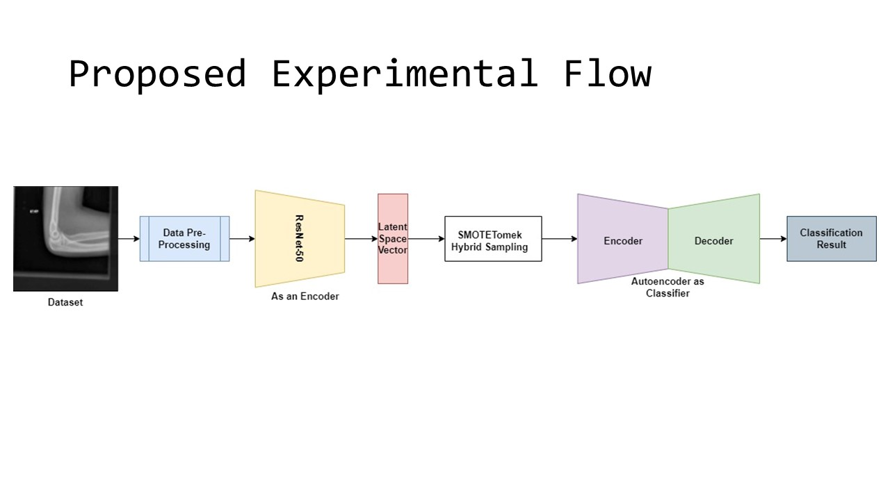
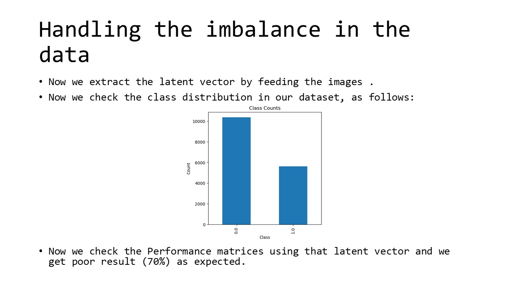
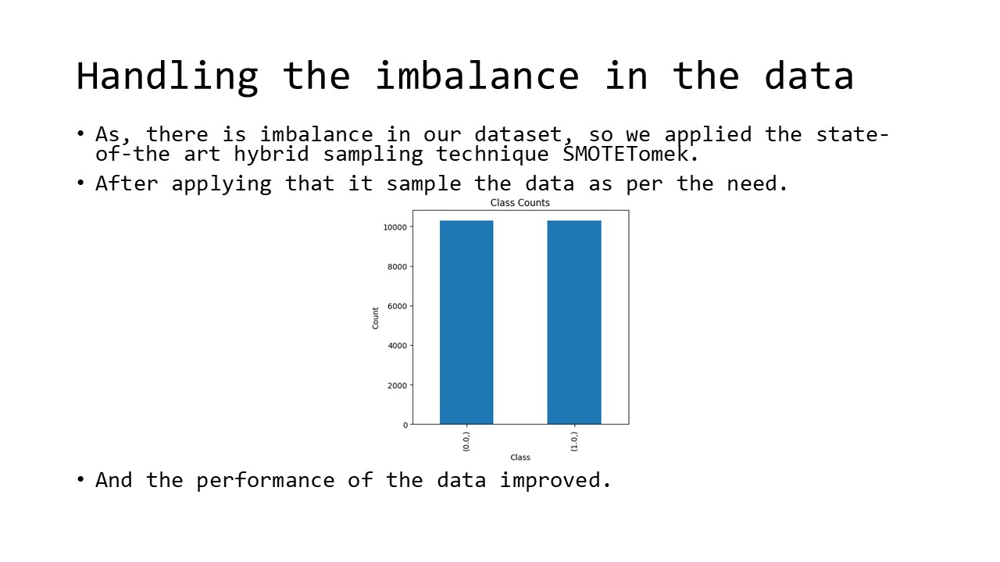
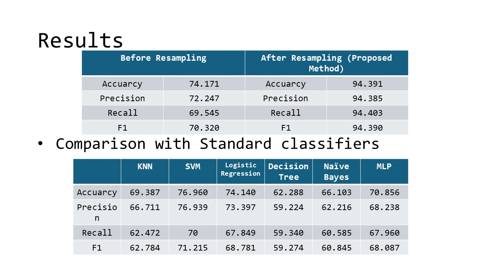
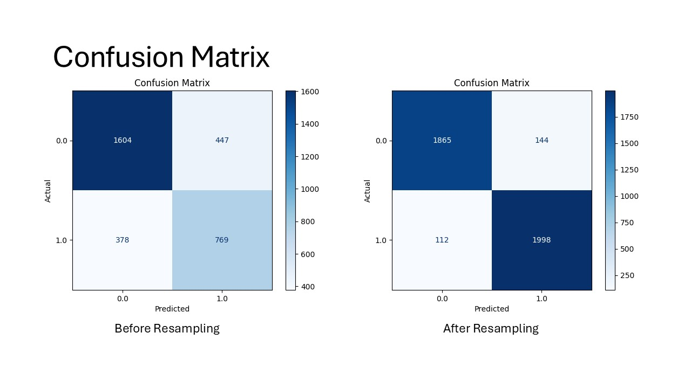
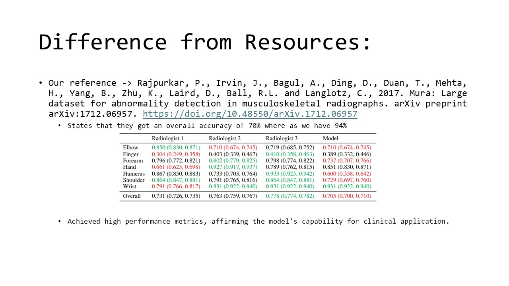

# Autoencoder-Based-Abnormality-Detection-in-Bone-X-Ray-images-Using-MURA-Dataset
An autoencoder-based model to detect abnormalities in bone X-rays using the MURA dataset. We preprocess images (96×96), extract features using ResNet50, and address class imbalance with SMOTETomek. Our model achieves 94% accuracy, aiding radiologists in diagnosis.

## 📂 Project Structure  

- **`MURA.ipynb`** – Contains the proposed model and experiment details.  
- **`comparison.ipynb`** – Includes results from different standard classifiers using the same dataset.  
- **`test.ipynb`** – Code to test the trained model on any `test.png` image.  
- **`encoder.h5`** – Pre-trained **ResNet50 encoder** for feature extraction.  
- **`classifier.h5`** – The proposed **autoencoder-based classifier** model.  

